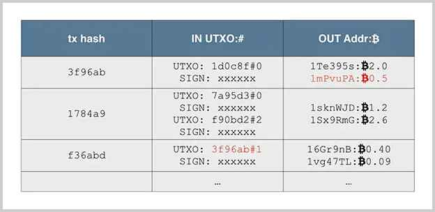
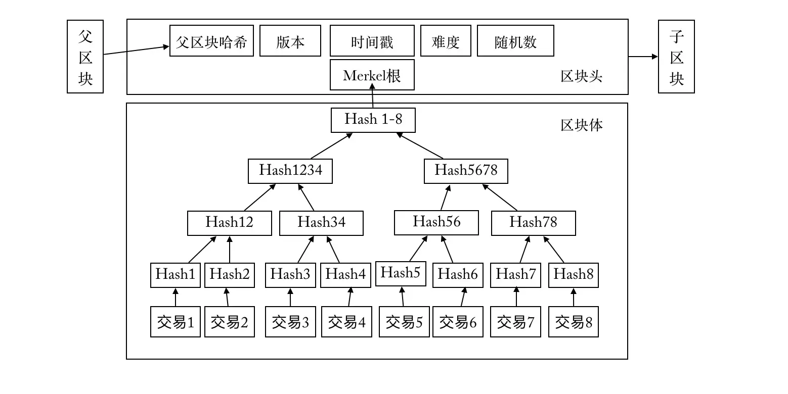
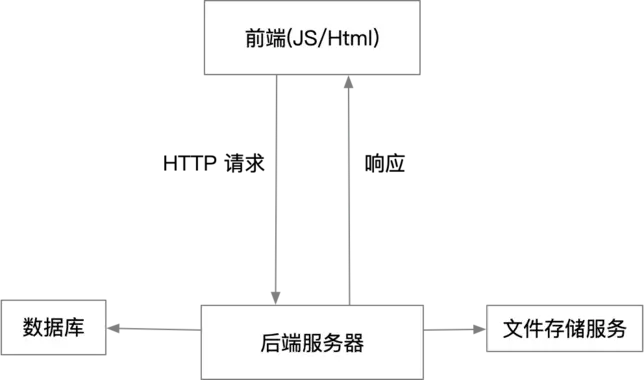
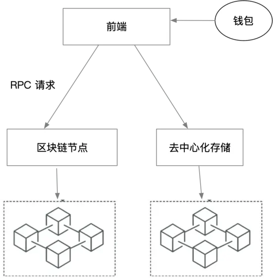

此笔记用做对加密货币有个概念，同时对一些术语进行扫盲

## 简介

### 比特币的诞生

去中心化加密货币

[《比特币：点对点的电子现金系统》](https://bitcoin.org/bitcoin.pdf)这篇论文代表着加密货币的诞生

### 共识

就是让所有参与互联网的节点(计算机)都达成共一个看法，对于比特币来说就是所有节点看到和维护的都是同一个账本。

#### POW工作量证明

Proof of Workd("工作量证明")，率先完成工作量证明的节点，拥有区块的写入权，其他节点在此基础上进行后续的交易记录的工作量证明。

工作量证明的最重要的一个点是计算一个数学难题，类似于于哈希的破解，不断的去尝试，知道计算出结果，此时你就可以将交易信息打包并进行广播，链上完成验证后就会将区块链事实上写入区块链(51%)

#### POS 权益证明

以太坊升级之后采用的共识机制。

POS： Proof of Stake， 节点争夺记账权依靠的不是算力而是**权益（占比）**，权益通常是通过质押数字货币计算而来。**PoS同样需要计算哈希值，当拥有的权益越多，满足Hash目标的机会越大，获得记账权的机会越大**。同时质押的货币也作为抵押品防止作恶，如果节点有恶意行为，其抵押品可以被罚没（Slashing）。

节点在POS共识中，节点被称为验证者。

#### POA权威证明

选出中央权威来统一状态，违背了去中心化的思想。POS： Proof of Stake， 节点争夺记账权依靠的不是算力而是权益（占比），权益通常是通过质押数字货币计算而来。PoS同样需要计算哈希值，当拥有的权益越多，满足Hash目标的机会越大，获得记账权的机会越大。同时质押的货币也作为抵押品防止作恶，如果节点有恶意行为，其抵押品可以被罚没（Slashing）。

### 加密货币的价值

具有"货币"的特性，比如:可流通性，可存储性，可分割性，同时对比法币有更好的稀缺性(比特币从一开始设置的个数就是有限个)

## 如何交易

这里有个概念叫做UTXO:Unspent Transaction Output，直译过来就是未花费输出

这里廖雪峰老师的博客讲的更好

其实就是输入和输出，区块链上包含的就是这样的交易记录的集合

### 如何验证交易

对于交易f36abd，它记录的输入是3f96ab，索引是1(索引从0开始，0表示第一个输出，1表示第二个输出)，我们就根据3f96ab找到前面已经发生的交易，再根据索引号找到第一个输出，也就是1mPvuPA这条交易记录，对应的输入是0.5，0.5-(0.40+0.09)，扣的那0.1就是交易的手续费

### 钱包

管理私钥(生成、存储、签名)的工具

### 私钥&公钥&签名

在比特币中，私钥本质上就是一个256位的随机整数，在进行加密时需要用到这串数字

公钥是根据私钥有ECDSA算法推算出来的，公钥有压缩和非压缩两种表示方法，可以互相转换

比特币地址是一串字符，相当于银行账号，公开发分享之后其他人可以向你发送比特币。

签名算法是使用私钥签名，公钥验证的方法，对一个消息的真伪进行确认。如果一个人持有私钥，他就可以使用**私钥对任意的消息进行签名，即通过私钥 `sk`对消息 `message`进行签名**，得到 `signature`。

签名的目的是为了证明，该消息确实是由持有私钥 `sk`的人发出的，任何其他人都可以对签名进行验证。验证方法是，由**私钥持有人公开对应的公钥 `pk`，其他人用公钥 `pk`对消息 `message`和签名 `signature`进行验证**

### 发起交易

1. 交易输入：他们指向**之前的交易创建的UTXO(可以是自己账户的UTXO，也可以是任何其他人发送给你并锁定到你地址上的UTXO)**，通常钱包会收集当前可用的UTXO集合作为交易的输入
2. 交易输出：表明多少比特币会锁定哪些地址，即生成新的UTXO
3. 签名：用私钥来解锁交易输入的UTXO（就是用私钥对于输入的UTXO进行加密）

### 节点验证交易有效性

交易池mempool是未确认的交易的缓存，以便矿工从种挑出手续费率最高的交易，打包到区块中。

### 使用工作量证明挖掘新区块

创建一个新区块的过程差不多是这样的：

矿工从从交易池中找出最优的一组交易（在一个区块限制下，手续费收益最大），给这组交易创建merkle树， 然后不断的执行暴力哈希运算，以求解出满足一下 Hash 目标值的nonce值

## 区块链技术

### 概述

狭义上说区块链是一种区块通过 Hash 方式形成的链式结构，因为链的环环相扣，任何一个区块上的修改，破坏链结构

#### 特点

分布式账本技术、不可篡改的记录、智能合约

### 智能合约(重点)

#### 以太坊

一个区中心化的应用平台。

智能合约是区块链上可执行的代码，用户可以根据自己的业务需要上传自己的代码到以太坊上。

#### 区块链分叉

因为区块链是分布式系统，每次升级，需要所有的节点客户端软件共同升级，有时一些节点因为利益或理念的不一致，拒绝升级到新的客户端，此时网络中将出现两个版本的客户端，运行新软件的节点就会用新的协议去构建新的区块，原有的客户端节点会继续用旧的协议来继续构建区块，各节点不认可对方的区块，此时就是会分叉出两条完全不同的链，这就是区块链的分叉，这种情况是硬分叉。

##### 硬分叉

硬分叉是共识的分裂或者改变

##### 软分叉

软分叉向后兼容，没有更新的节点仍然会仍可新版本生成的区块，当升级后的区块链将无法识别尚未更新的节点的区块

## 区块链分类

### 公链

公开的、透明，区块链上的信息对任何人都可见

### 私链

私链是一种不公开、只有被授权的节点才可以参与并查看数据的私有区块链，也称为许可链

### 联盟链

联盟链由多个组织共同拥有，由联盟内成员节点共同维护，节点通过授权后才能加入联盟网络。

## 区块链分层

### Layer0

还没有完全一致的理解，多数人认为是**加密数据连接层及其硬件**

### Layer1

比特币、以太坊、BSC和Solana等。这些区块链在自己的区块链上根据共识处理并完成最终的交易

第1层区块链为开发dApps提供了基础架构，开发者可以在第1层网络上开发其他协议，比如我们看到MAKER DAO稳定币协议、加密朋克以及Unisswap DEX协议等。

随着链上应用的增长，网络"吞吐量"无法快速地满足交易写入的需求，有两种解决的方向，一种扩大节点的存储容量，但是会提高节点参与网络的门槛，使得网络更加中心化；另一个是方法是以太坊在尝试的分片(sharding)扩容方案，将区块链数据分成不同的组(分片)，每个分片负责网络活动中的不同交易子集。

### Layer2(二层网络)

Layer2是针对底层区块链(Layer1)扩容的一种链下解决方案，Layer2是一个独立的区块链，但使用第一层的安全性保证。

扩容主要思想是将原本Layer1的交易放在链下(Layer2)执行，减轻Layer1的负担，并且Layer2定期于Layer1通信，将Layer2的交易批量提交到Layer1

#### 比特币闪电网络

在比特币上的一个主要的Layer2扩容方案是闪电网络(Lighting Network)，为小额支付场景进行优化。闪电网络的主要实现是，支付的双方在链下建立一个通道，双方可以在这个通道多次交易，在需要结算时再写回链上。

#### Rollup(卷起)

Rollup的核心思想是把由Rollu层负责执行交易，然后许多笔交易压缩成一笔加以提交给以太坊。

##### Optimistic Rollup乐观

乐观假设从Layer2上执行的交易都是可信的，并批量提交到以太坊上，有个挑战期，期间内任何人都可以来验证交易的真实性，若挑战成功，原有交易被拒绝，并惩罚Layer2出块人。

##### ZK Rollup 零知识证明Rollup

而ZK Rollup则是通过生成一个零知识证明来证明所有交易的有效性，相比Optimistic Rollup没有乐观假设，而且具有更高的数据压缩率，就是开发难度很大。

### Layer3

目前还没有一致认可的定义，L2用于扩容，L3用于自定义功能，例如隐私。

## web3与去中心化存储

### 互联网演进

web1(只读)->web2(能读能写)->web3(能读能写能拥有)

### web3技术堆栈

Web3应用，技术架构则有所不同：

### 去中心化存储

区块链用于执行逻辑，是一个去中心化计算平台，并不是为存储大量数据而设计的，当我们需要保存图片、音频、视频等内容时，则需要适合大数据的存储方案。

#### IPFS协议

IPFS目标是取代HTTP去构建一个更好的去中心化的Web。 **现有的HTTP网络服务，基于IP寻址的，就是IP找到内容所在的服务器，然后再与服务器交互** 。而在IPFS的网络里是根据**内容寻址**的，我们上传到IPFS的文件都会产生哈希值，无需知道文件存储在哪里，通过哈希值就能够找到这个文件。

#### Arweave

Arweave 是一个区块链网络，数据保存在网络中的区块里

## 区块链应用场景

### 金融服务

### 跨境支付/结算

### 资产数字化/代币化

### DeFi

DeFi，Decentralized Finance（去中心化金融）的缩写， 利用区块链智能合约在链上完成资产兑换、借贷、杠杆、期货等交易

### DAO组织

Decentralized Autonomous Organization，即去中心化自治组织，DAO是一种将组织的管理和运营规则以智能合约代码的形式编码在区块链上，DAO的决策基于组织成员持有的代码进行投票进行。

### 数字存证/防伪

区块链可以通过哈希时间戳证明某个文件或者数字内容在特定时间的存在，加之其公开、不可篡改、可溯源等特性。可以应用于产权、版权等所有权的管理和追踪，以及身份证明，司法鉴定。

### NFT/数字艺术品

NFT（Non Fungible Token）非同质化代币，与 Token 一样也是智能合约的标准，NFT 用来表达具有独特特性的东西（两个东西不能互换）。

### 游戏

基于 NFT 的以太猫（CryptoKitties）游戏在以太坊上线。用户可以通过以太币购买虚拟的以太猫，然后繁育下一代，同时也可以出售自己拥有的以太猫
